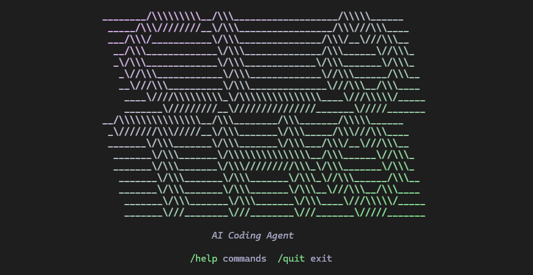

# Clotho

<p align="center">
  
</p>

A local AI assistant with a gateway architecture. Clotho runs a local server that manages agent sessions, tool execution, and model routing. Interact with it through the terminal REPL, Discord, scheduled jobs, or build your own client against the REST/WebSocket API.

## Installation

Requires Python 3.12+ and [pipx](https://pipx.pypa.io).

```bash
pipx install git+https://github.com/superkosat/clotho.git
clotho setup    # generate auth token
```

## First Run

```bash
clotho          # starts gateway + REPL
```

Configure a model profile before chatting:

```
/profile add
Profile name: anthropic
Provider: anthropic
Model: claude-haiku-4-5-20251001
API Key: sk-ant-...

/profile default anthropic
```

## REPL Commands

**Model profiles**
| Command | Description |
|---|---|
| `/profiles` | List all profiles |
| `/profile add` | Add a new profile (interactive) |
| `/profile use <name>` | Switch profile for this session |
| `/profile default <name>` | Set default profile for new sessions |

**Chats**
| Command | Description |
|---|---|
| `/chats` | List all saved chat sessions |
| `/chat new` | Create and switch to a new chat |
| `/chat <id>` | Resume an existing chat |

**Permissions**
| Command | Description |
|---|---|
| `/permissions` | Show current permission config |
| `/permission mode <mode>` | Set mode: `interactive`, `autonomous`, `readonly` |
| `/permission set <tool> <level>` | Override a tool: `allow`, `ask`, `deny` |
| `/permission clear <tool>` | Remove a tool override |

**Streaming**
| Command | Description |
|---|---|
| `/stream` | Show current streaming status |
| `/stream on` / `/stream off` | Toggle response streaming on or off |

Streaming is enabled by default. When on, responses render incrementally as tokens arrive. When off, the full response is delivered after the model finishes.

**Context**
| Command | Description |
|---|---|
| `/context` | Show context window usage |
| `/compact` | Summarize old turns to free context space |

**Sandbox**
| Command | Description |
|---|---|
| `/sandbox` | Show sandbox status |
| `/sandbox on` / `/sandbox off` | Enable or disable sandboxing |
| `/sandbox build` | Build the Docker sandbox image |

**Channels**
| Command | Description |
|---|---|
| `/setup` | Configure a messaging channel (Discord, ...) |

## Providers

Clotho supports three providers via named profiles:

| Provider | Value |
|---|---|
| Anthropic | `anthropic` |
| OpenAI (or compatible) | `openai` |
| Ollama (local) | `ollama` |

Profiles are stored in `~/.clotho/profiles.json`.

## Permission Modes

- **interactive** (default) — asks for approval before every tool call
- **autonomous** — auto-approves all tools
- **readonly** — denies all tools except `read`

Per-tool overrides apply on top of the active mode.

## Sandbox

When enabled, bash commands run inside a Docker container with:
- Read-only root filesystem
- No network access
- 512MB RAM / 1 CPU limit
- Workspace mounted at `/workspace`

Docker must be running. Build the image once before enabling:

```bash
clotho sandbox build
```

Sandbox is disabled by default.

## Skills

Clotho will discover and load skill descriptions into the system prompt if they are located under `~/.clotho/skills/` with a `SKILL.md` file:

```
~/.clotho/skills/
    commit/
        SKILL.md
    review-pr/
        SKILL.md
```

`SKILL.md` starts with YAML frontmatter declaring the skill's name and description. The rest of the file contains instructions that the agent reads on demand when it determines the skill applies.

```markdown
---
name: commit
description: Stage and commit changes with a conventional commit message.
---

<instructions for the agent to follow>
```

Only the frontmatter metadata is injected into the system prompt. The full instructions stay on disk and are loaded by the agent when a skill matches the user's request.

## Discord Bridge

Clotho can connect to Discord as a bot, letting you interact with the agent through DMs or server channels. The bridge is a standalone process that connects to a running gateway.

```bash
clotho run -d       # start gateway in background
clotho-discord      # connect to Discord
```

### Setup

1. Create a Discord application at [discord.com/developers/applications](https://discord.com/developers/applications)
2. Add a bot under the **Bot** tab; enable **Message Content Intent**
3. Copy the bot token
4. Generate an invite URL under **OAuth2 > URL Generator** — select the `bot` scope with permissions: Read Messages, Send Messages, Read Message History
5. Invite the bot to your server

### Configuration

Create `~/.clotho/discord/config.toml`:

```toml
[gateway]
host = "localhost"
port = 8000
# token falls back to ~/.clotho/config.json if omitted

[discord]
bot_token = "..."               # required — from Developer Portal
session_mode = "user"           # "user" (per-user context) or "channel" (shared context)
tool_approval = "auto_allow"    # "auto_allow" or "auto_deny"
mention_only = true             # require @mention in servers (DMs always respond)
chunk_limit = 1900
allowed_guild_ids = ["*"]       # ["*"] = all, [] = deny all, or specific IDs
allowed_channel_ids = ["*"]     # same format
stop_codeword = "!stop"         # cancel current session
stopall_codeword = "!stopall"   # cancel all sessions globally
```

### Attachments

The bridge handles Discord attachments automatically:

| Type | Extensions | Behavior |
|---|---|---|
| Images | png, jpg, jpeg, gif, webp | Sent as base64 content blocks to the model |
| Audio | ogg, mp3, wav, m4a, flac | Saved to temp file; agent transcribes via whisper skill |
| Text/code | txt, md, csv, json, py, js, ... | Inlined as code blocks (up to 100 KB) |
| Binary | everything else | Noted with metadata; contents not included |

### Reactions

The agent can add reactions to the user's message by including `{{react:emoji}}` directives in its response. The directive is stripped from the text and applied as a Discord reaction.

## Scheduled Jobs

Jobs run agent prompts on a cron schedule and deliver responses to Discord channels or DMs.

Define jobs as YAML files in `~/.clotho/jobs/`:

```yaml
name: daily-standup
enabled: true

trigger:
  type: cron
  expression: "0 9 * * 1-5"    # 9 AM weekdays (5-field cron)

prompt: "Generate a daily standup report."

delivery:
  - type: discord_channel
    channel_id: "123456789"
  - type: discord_dm
    user_id: "987654321"
```

The scheduler loads jobs on gateway startup and re-scans the jobs directory for changes. Each job maintains its own persistent chat session so context accumulates across runs.

## Context Compaction

Long conversations are automatically compacted when the context window reaches 75% capacity. Old turns are summarized by the model while the most recent exchanges are preserved verbatim. You can also trigger compaction manually with `/compact`.

## CLI Reference

```bash
clotho                          # start REPL (default)
clotho "your prompt here"       # start REPL with an initial prompt
clotho -p "prompt"              # print mode — send prompt, print response, exit
echo "prompt" | clotho -p      # print mode from stdin
clotho -p "prompt" --chat ID   # print mode into an existing chat
clotho -p "prompt" --timeout 60
clotho run -d                   # start gateway as detached background process
clotho run --port 9000          # custom port
clotho setup                    # generate auth token
clotho setup --force            # regenerate token
clotho sandbox build            # build Docker sandbox image
```

**Print mode** (`-p`) sends a single prompt and writes the raw response to stdout with no formatting — suitable for piping and scripts. Tool requests are auto-approved (gateway permission policy still applies). Default timeout is 300 seconds.

## Config Files

All config and persisted data lives in `~/.clotho/`:

| Path | Contents |
|---|---|
| `config.json` | Permissions, sandbox settings, auth token |
| `profiles.json` | Model profiles |
| `projects/*.jsonl` | Chat history (one file per session) |
| `skills/*/SKILL.md` | Skill definitions |
| `discord/config.toml` | Discord bridge configuration |
| `discord/sessions.json` | Discord user/channel → chat ID mapping |
| `jobs/*.yaml` | Scheduled job definitions |
| `scheduler/jobs.sqlite` | APScheduler job state |
