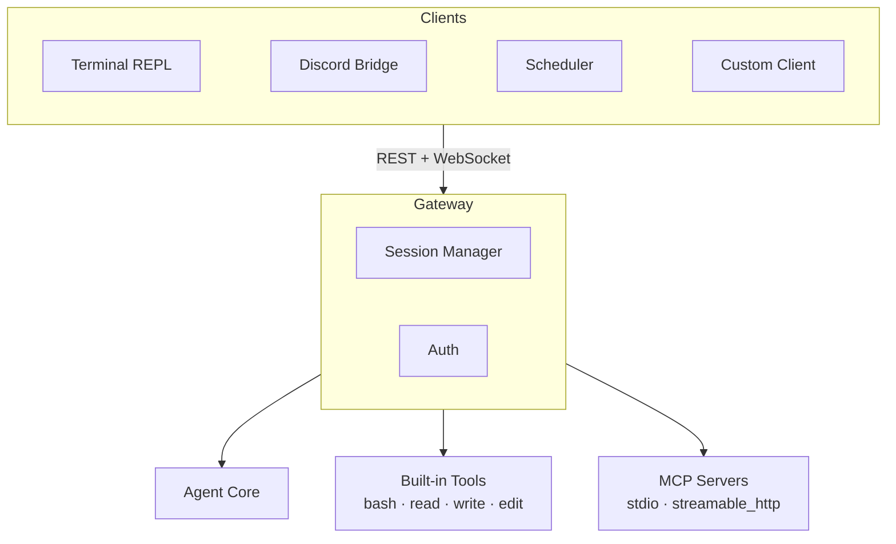

# Clotho

An agentic harness with a central gateway architecture. Clotho runs a local server that manages agent sessions, tool execution, and model routing. Interact with it through the terminal REPL, Discord, scheduled jobs, or build your own client against the REST/WebSocket API.

## Quick Start

```bash
pipx install git+https://github.com/superkosat/clotho.git
clotho setup    # generate auth token
clotho          # start gateway + REPL
```

Then configure a model profile:

```
/profile add
/profile default <name>
```

## Architecture



The gateway is the single point of entry. All clients — the terminal REPL, Discord bridge, scheduler, or your own code — connect over HTTP/WebSocket using a shared auth token.
